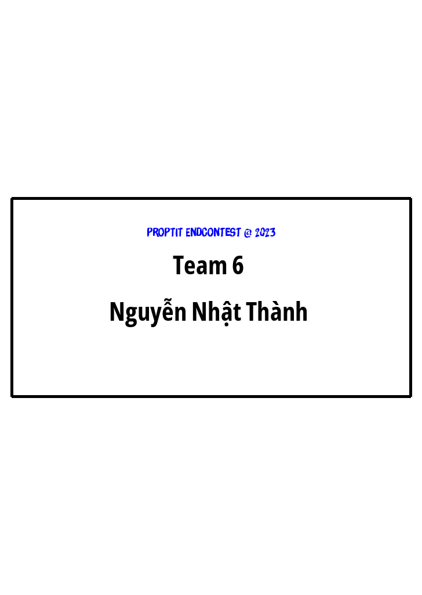

# Bangtentudong
Tự động sinh ra bảng tên cho các thí sinh trong một kì thi từ một file tên bằng Python

# Bảng tên tự động 🔥🤖

Tự động sinh ra bảng tên cho các thí sinh trong một kì thi từ một file tên bằng Python

## installing

### The Easy Way

- Tải file về và chạy file main.py, cho tên các thí sinh vào từng dòng trong file 

### Variable Explanations

* `W`: Chiều rộng của ảnh
* `H`: Chiều dài của ảnh
* `file1`: Tên của file

### Demo ảnh bảng tên (<ProPTIT/> GGWP)

### Demo ảnh được sinh ra theo output

