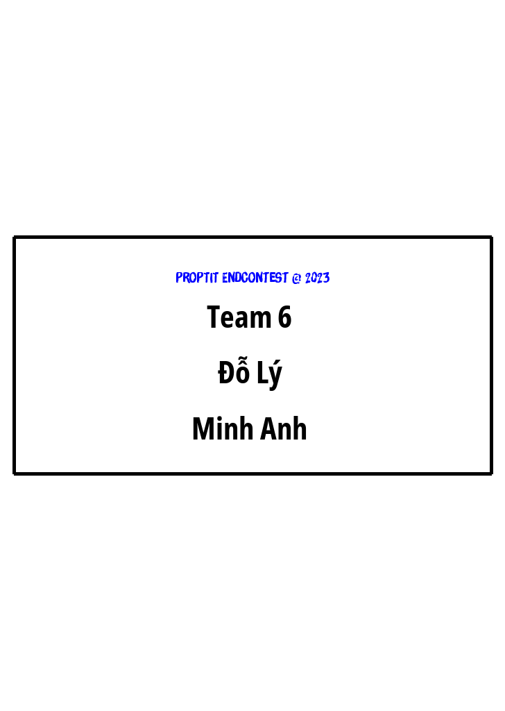

# Nameplate For Contest
Tự động sinh ra bảng tên cho các thí sinh trong một kì thi từ một file tên bằng Python (Tự động căn giữa theo tên)

# Nameplate For Contest

Tự động sinh ra bảng tên cho các thí sinh trong một kì thi từ một file tên bằng Python

## Installing

### The Easy Way

- Config tên các thí sinh trong file `input.txt`
- Tải file về và chạy file main.py
- Kết quả trong thư mục `output`

### Variable Explanations

* `W`: Chiều rộng của ảnh
* `H`: Chiều dài của ảnh
* `file1`: Tên của file

### Demo ảnh được sinh ra theo output

### Demo ảnh bảng tên (<ProPTIT/> GGWP)
